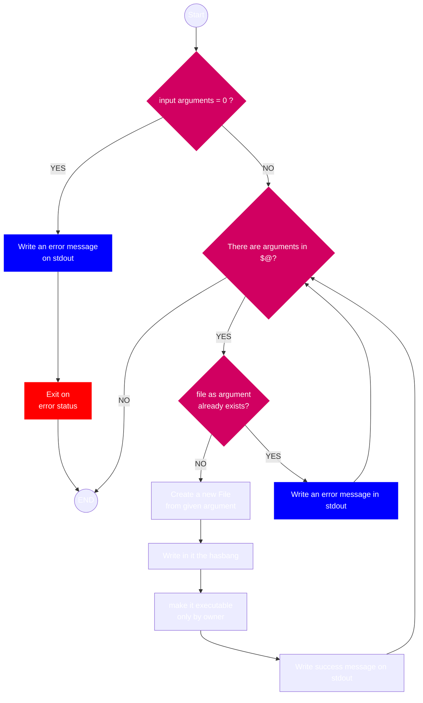

# Bash File Creator 🪄

The script that creates a new empty bash file with hashbang e makes it executable.

## How it works ⚙️

The script requires to user the following parameters:

- name of file

The script accepts multiple file name as arguments and creates a new file ready to be edit and writes in the hashbang e makes it executable only by the owner.

It can creates as many files as many given names. 

## How to use it 🚀

1. Make it executable   `chmod +x bashfile.sh` 
2. Execute the script   `./bashfile.sh arg1 arg2...`

## Why this script? 💡
Because it can makes this operation faster then manually create single or multiple new bash files.

## Flowchart
