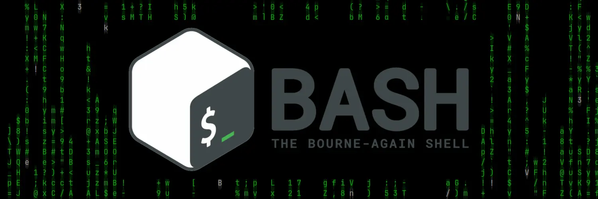

# Bash Utility Scripts

  
 <b>A collection of bash utility scripts</b>

## Network
1. [Samba Sharing Wizard](SambaSharing/) A configuration wizard for Samba.

## System
1. [Bash File Creator](BashFile/) Creates n bash file(s) ready to be edit.
2. [Multi Packages Installation](MultiPackages/) Install multiple packages from a text file.
3. [Open Vault](OpenVault/) open an encrypted directory with gocryptfs
4. [Rsync Backup with Log](RsyncBackupLog/) Backups file or directory with rsync and writes a log file.
5. [USB Device Disconnection](DeviceDisconnection/) Safely disconnect a USB drive.
