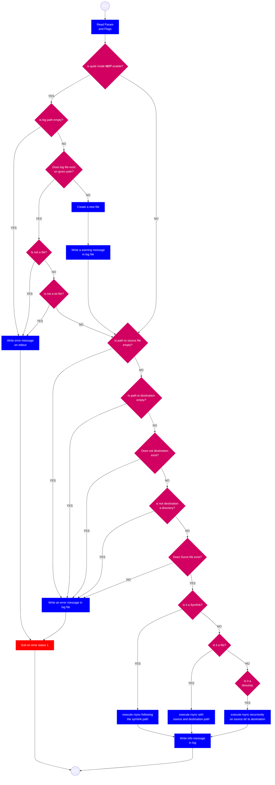

# Rsync Backup Log 📂
The script that backups file or directory with rsync and writes a log file.

## How it works ⚙️

The script executes a backup of a file or directory from given SOURCE path to given DESTINATION path. Each operation (info, warning or error) is written in a log txt file. If quiet mode is enabled no log file will be use.

## Requirements 🛠️
Make sure that on your system is installed: 
```
 rsync 
 realpath
 ```

## Parameters 📋

|Parameter|Description|
|---------|-----------|
|-s| the source path of file or directory to backup. If the source path point to a symLink, rsync will backup the actual file by following the symlink path.
|-d| the destination path where to save the backup, it must be a directory|
|-l|the log file path, it must be a txt file. If the file doesn't exist on the given path a new one is created|
|-q| enable quiet mode, no log file will be use|


## Log 📄
The log messages include timestamp and are of three categories:

|Category| Description |
|----------|-------------|
|INFO| message that reports an operation executed with success|
|WARNING| message that reports a failed operation but the script can continue|
|ERROR| message that reports a failed operation and script exits on error status.


## Hint 💡
This script is designed to work with **cron**. If you want to set a crontab, remember to use absolute paths.

## How to use it 🚀
1. Make it executable: `chmod +x rsyncbakuplog.sh` 
2. Execute the script like in the following example:

`./rsyncbakuplog.sh -s path/to/yourfile.txt -d path/to/backupdir -l path/to/logfile.txt`

if you want to enable quiet mode

`./rsyncbakuplog.sh -s path/to/yourfile.txt -d path/to/backupdir -q`

## Be carful! ⚠️
**This script work with files and directories. Make sure that you know what are you doing**.

## Flowchart
