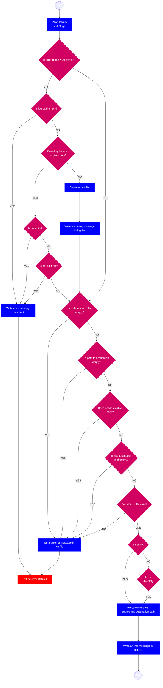

```mermaid
flowchart TD

%% Classes Def %%
    classDef default color:#fff;
    classDef process fill:#0000ff,stroke:#cc9900,stroke-width:0px;
    classDef error fill:#ff0000,stroke:#cc9900,stroke-width:0px;
    classDef condition fill:#d10061,stroke:#cc9900,stroke-width:0px;


         START((Start))
        --> Readparam[Read Param<br>and Flags]:::process
        --> isNotQuite{is quite mode <b>NOT</b> enable?}:::condition

    isNotQuite --YES--> logpathempty{is log path empty?}:::condition
    isNotQuite --NO--> isSouceEmpty
    %%Log Path is empty%%
    logpathempty --YES--> error[Write error message<br> on stdout]:::process --> e[Exit on error status 1]:::error
    logpathempty --NO--> logfileExists{Does log file exist <br>on given path?}:::condition
    %% log path exists %%
    logfileExists --YES--> isLogfile{Is not a file?}:::condition
    --YES-->error
        logfileExists --NO--> createFile[Create a new file]:::process
        ---> writemessage[Write a warning message<br>in log file]:::process
        --->isSouceEmpty
    isLogfile --NO--> isTxtfile{is not a txt file?}:::condition
        --YES--> error

        isTxtfile --NO--> isSouceEmpty{Is path to source file<br> empty?}:::condition
    %%Source File%%
        --YES-->errorlog[Write an error message in log file]:::process
        -->e
        isSouceEmpty --NO--> isDestinationEmpty{Is path to destination<br> empty?}:::condition
    %%Destination File%%
        isDestinationEmpty --YES-->errorlog
        isDestinationEmpty --NO--> destinationExists{Does not destination<br>exist?}:::condition
            destinationExists--YES-->errorlog
            destinationExists--NO-->isDestinationDir{is not destination <br>a directory?}:::condition
            isDestinationDir--YES-->errorlog
        %%Source Exists%%
            isDestinationDir--NO-->SourceExists{Does Surce file exist?}:::condition 
        SourceExists --NO-->errorlog
        SourceExists--YES-->isSourceAfile{Is it a file?}:::condition
        isSourceAfile --YES--> execrsync[execute rsync with <br>source and destination path]:::process
        ----> writeinfolog[Write an info message in log file]:::process ---> endscript((END))
        isSourceAfile --NO--> isSourceAdir{Is it a<br>directoty}:::condition
        isSourceAdir --YES-->execrsync
    

    


```